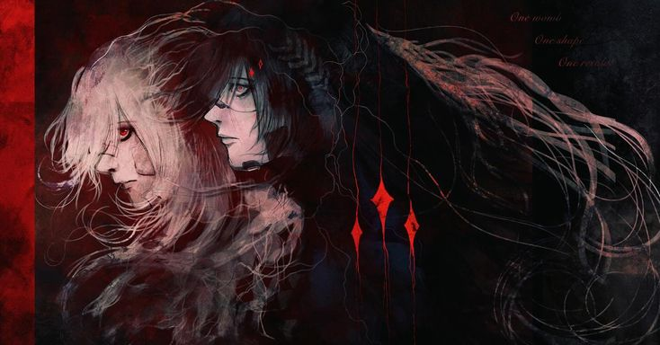

  

    
  

----

  
  

  <code>> print("Hello World! I am Victoria Suares.")</code>
  

  Estudante de Engenharia de Software com foco em <b>Cybersecurity, GRC e Threat Intelligence</b>. Membro do Comitê Público do <b>IDCiber</b>, <b>AI Intern</b> na FlyRank AI e <b>Google Student Ambassador</b>.
    
  Atuo na interseção entre governança de riscos, segurança de dados e desenvolvimento com <b>Python e Java</b>, além de conduzir pesquisas em conformidade e transparência algorítmica (PIBIC).
  

  

 

---

<h3>Technologies</h3>

 

---

  <h3>Statistics</h3>
  <table>
    <tr>
      <td align="center">
        
      </td>
      <td align="center">
        
      </td>
    </tr>
  </table>

 

